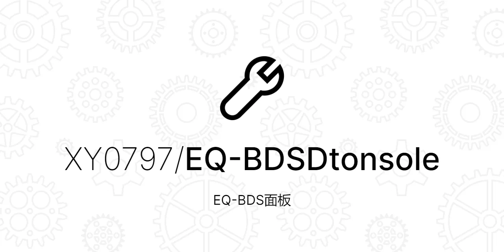

<h1 align="center">EQ-BDS面板 || 一站式BDS开服解决方案</h1>

  
  
  

> #### 一个稳定、易用、扩展性强的Windows BDS面板
> #### 专为BDS打造，集成了大量功能，采用分体式架构，稳定好用

(介绍页有下载与食用方法)

+ #### MineBBS帖子：https://www.minebbs.com/resources/eq-bds-3-8.4289/
+ #### QQ群：👉[1072180746](https://jq.qq.com/?_wv=1027&k=jPV9ohWe)👈

# 💾 项目引用

### 1. 本项目的大量使用了[精易模块](http://ec.125.la/)封装的Win32API

### 2. 本项目的网络通讯组件来自于[HP-Socket](https://github.com/ldcsaa/HP-Socket)

### 3. 本项目使用了[meng9934](https://bbs.125.la/forum.php?mod=viewthread&tid=14691896)封装的多线程库(常用功能支持库2.0#2)

### 4. 本项目使用了zyJson封装的json模块，用于处理json数据
(注：未找到该作者的联系方式，只能在这里感谢该作者的默默付出)

### 5. 本项目使用了[Mujs脚本引擎](https://www.mujs.com/)，本人封装为DLL并且由易语言调用

# 🤝 贡献

### 欢迎提出你的建议！

### 如果有任何问题，欢迎到[issues page](https://github.com/kefranabg/readme-md-generator/issues)反馈或[加入我们的QQ群](https://jq.qq.com/?_wv=1027&k=jPV9ohWe)

# 作者

## 👤 **XY0797**

- ### QQ号：1559095867

- ### e-mail：1559095867@qq.com

# 支持我们

### 如果您觉得本项目对您有用的话，请⭐️本代码仓库

### Please ⭐️ this repository if this project helped you!

# 📝 开源协议

Copyright © 2023 [XY0797](https://github.com/XY0797)

鉴于易语言的特殊性,EQ面板不会全部开源，否则可能被黑产利用

仅开源EQ面板除了加密算法、面板主程序和QQ机器人插件之外的部分

本仓库代码以[MPL-2.0](https://github.com/XY0797/EQ-BDSDtonsole/blob/master/LICENSE)协议开源
