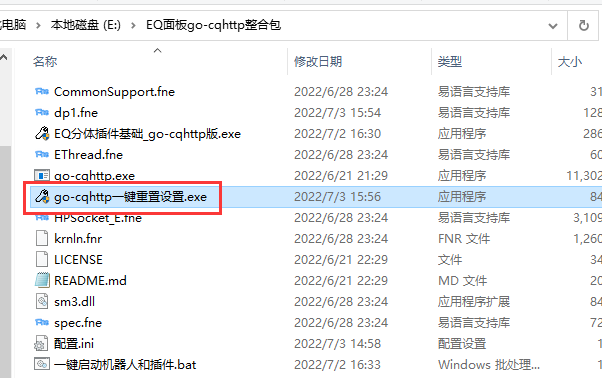
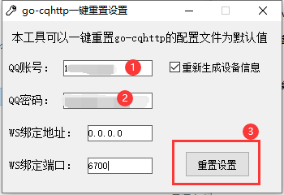
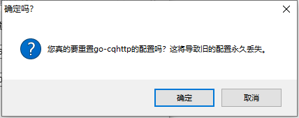
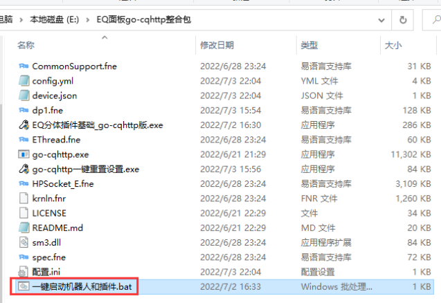
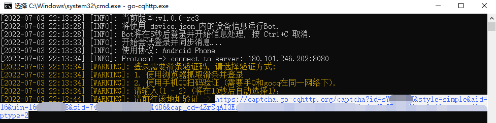
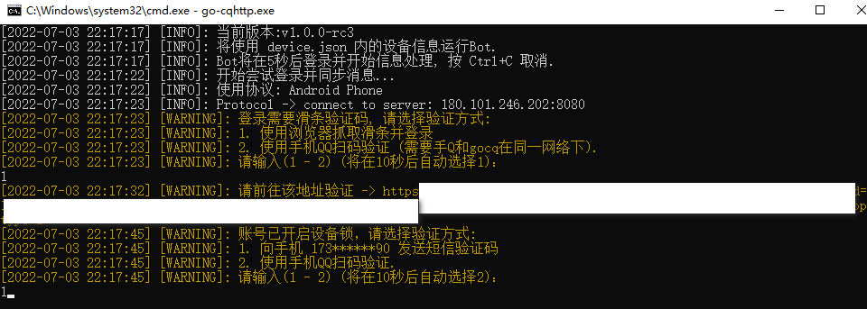
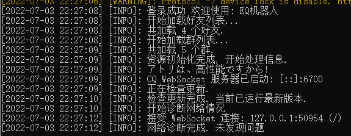
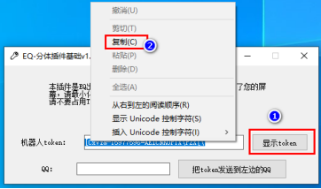
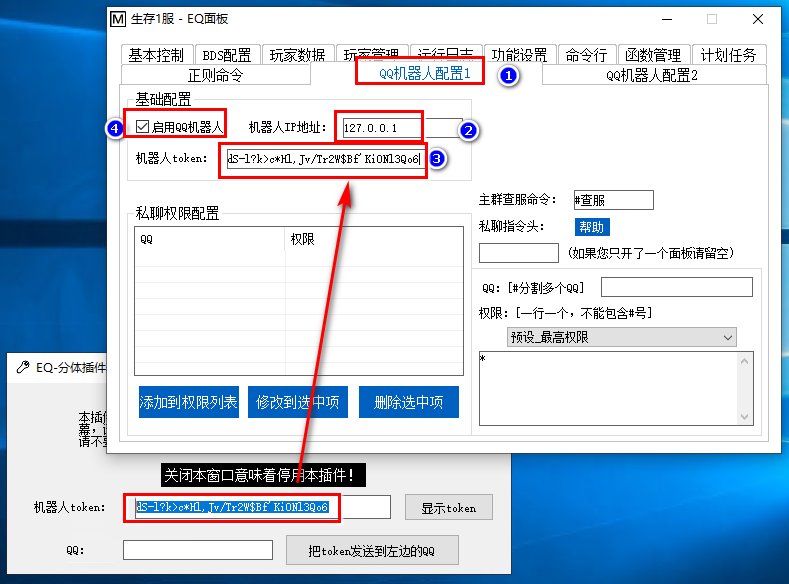
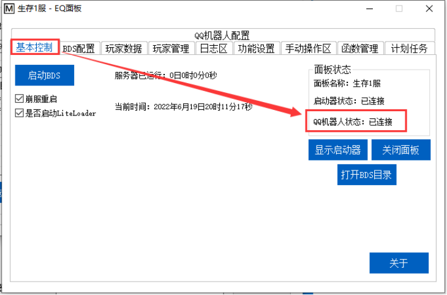

## 一、安装火绒安全
当然，您也可以不选择火绒，使用其他杀毒软件，到时候给插件加上信任即可。安装完成后禁用Windows Defender，详见EQ-BDS面板用户手册
## 二、解压压缩包
直接把压缩包内的文件夹解压出来即可
> 如果您有**已经配置好了**的go-cqhttp，后面的步骤都不需要，只需要直接运行"EQ分体插件基础_go-cqhttp版.exe"即可，输入IP端口即可

## 三、配置账号密码
#### 1.运行“go-cqhttp一键重置设置.exe”

#### 2.输入您的QQ账号、密码，其他设置不要动，点击重置设置，弹出的询问窗口点击确认

## 四、启动go-cqhttp
关闭“go-cqhttp一键重置设置.exe”，双击“一键启动机器人和插件.bat”，以后您要启动只需要双击“一键启动机器人和插件.bat”即可

如果您使用了严格的UAC控制，请留意任务栏是否有盾牌图标，如果发现有，请点击它并给予权限

## 五、通过滑条验证
#### 1.询问滑条验证码请选择1，不要选择2，选择2大概率会拒绝登录
#### 2.复制控制台上的链接，如图

#### 3.粘贴链接到浏览器中，拖动滑块，滑块验证通过后关闭浏览器
如果您是用手机远程桌面控制服务器，在选中后长按(右键)即可复制内容，粘贴到服务器上的浏览器即可
## 六、通过设备锁
询问设备锁验证方式，请输入1并按下回车，输入您接收到的短信验证码

## 七、判断是否设置完成
您接下来如果看到的是下图，说明配置成功

恭喜您成功拥有了一个QQ机器人，接下来只需要设置EQ插件即可
如果并没有看到这个页面可以截图咨询群友。EQ面板交流QQ群：[1072180746](https://jq.qq.com/?_wv=1027&k=aEsgpyKq)
## 八、设置EQ插件
#### 1.点击显示token，然后复制token

#### 2.打开EQ面板，点击“QQ机器人配置”选项卡，输入127.0.0.1
如果您的QQ机器人和您的面板不在同一台电脑(服务器)，却在同一局域网下，那么请输入QQ机器人所在电脑(服务器)的局域网IP。
如果QQ机器人和您的面板不在同一网络环境下，那么您得开放QQ机器人所在服务器的TCP6987端口，然后输入QQ机器人所在服务器的公网IP。
#### 3.粘贴机器人token，勾选启用QQ机器人。

等待些许时间，您会发现QQ机器人的状态变成了“已连接”
接下来您只需要填写号群号，并且根据EQ-BDS面板用户手册配置好私聊权限即可
